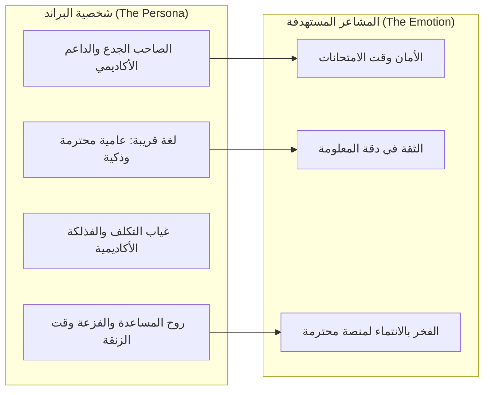

# دليل البراندينج والتسويق الرقمي للطلبة والشباب في مصر
### بناء العلامة التجارية، استراتيجيات النمو الفيروسي، وإعلانات تيك توك وميتا وسفراء الجامعات

الوصول للطالب الجامعي المصري يتطلب فهماً عميقاً لثقافته، مشاكله اليومية، طريقته في الحديث، وما يضحكه وما يثير اهتمامه الحقيقي. الإعلانات التقليدية الجافة تفشل فوراً مع جيل الـ Gen-Z المصري، بينما المحتوى القريب والحلول الصادقة تنتشر كالنار في الهشيم.

---

## 1. هوية البراند ونبرة الصوت (Brand Archetype & Tone of Voice)

### نبرة الصوت المعتمدة (Tone of Voice Matrix):
- **بين الطالب والمنصة:** "أخوك الكبير اللي سبقك في الكلية وعارف الدكاترة بيفكروا إزاي وهيخرجك من زنقة الفاينال سالم غانم."
- **ممنوع تماماً:** النبرة الحكومية المعقدة ("بناءً على القرار الوزاري...")، والنبرة الرخيصة المبتذلة (الكرينج المبالغ فيه).
- **المعادلة الذهبية للمحتوى:** **(معلومة أكاديمية حقيقية دقيقة + لمسة كوميدية خفيفة من واقع الكلية + حل فوري بضغطة زر).**

---

## 2. استراتيجيات التسويق عبر وسائل التواصل (Social Media Growth)

### 1. تيك توك وريلز إنستجرام (TikTok & Instagram Reels) — محرك الانتشار الأسرع:
- **فيديوهات المواقف الجامعية المتكررة (Relatable POV):**
  - "شكلك وأنت فاتح اللاب ليلة الفاينال وبتكتشف إن المنهج 14 شابتر مش 4."
  - "الفرق بين أول أسبوع في إعدادي هندسة وأسبوع الفاينال في رابعة."
- **فيديوهات الحلول السريعة:**
  - "إزاي تجيب درجات الشيت ده في 3 دقائق بدل 3 ساعات؟"
  - "حاسبة الـ GPA اللي هتقولك محتاج تجيب كام في الفاينال عشان متسقطش."
- **قاعدة الـ 3 ثواني الأولى:** خطف بصر وسمع الطالب فوراً بجملة تصدمه أو تجيب همه ("أوعى تدخل امتحان دكتور سامح وأنت مش مراجع الشيت ده!").

### 2. مجتمعات فيسبوك وجروبات الدفعات (Facebook Batch Groups):
- جروبات الكليات الرسمية والفرعية هي المكان الذي يتجمع فيه 100% من طلاب الدفعة.
- **التكتيك الفيروسي:** رفع ملخص ذهبي ومجاني بصيغة PDF مكتوب عليه ووترمارك ورابط المنصة، مع بوست مفيد بدون فجاجة إعلانية:
  > *"يا شباب ده ملخص الشابتر الأول والتاني منسق وجاهز للطباعة عملته عشان نلحق كويز الأسبوع الجاي، وبنك الأسئلة التفاعلي بتاعه كامل ومجاني على مُدَرّج هنا: [الرابط].. ادعولي دعوة حلوة وبالتوفيق."*

### 3. قنوات التيليجرام والواتساب (Telegram & WhatsApp Channels):
- تعتبر المنفذ المباشر بدون خوارزميات تحجب الوصول.
- بث فوري لـ: جداول الامتحانات أول ما تنزل، جداول المحاضرات، تنبيهات قبل تسليم الشيتات، روابط بنوك الأسئلة.

---

## 3. برنامج سفراء الكليات والجامعات (Campus Ambassadors Program)

السفير الجامعي هو ممثل المنصة على الأرض في كليته، وهو المفتاح لفتح أي جامعة بسرعة فائقة:
1. **اختيار السفراء:**
   - اختيار طالب من المتفوقين أو النشطين في الأنشطة الطلابية والاتحاد لكل فرقة دراسية.
2. **مهام السفير:**
   - نشر روابط المنصة في جروبات الدفعة الرسمية وقت الحاجة الحقيقية.
   - تزويد المنصة بأحدث الشيتات والامتحانات واللوائح فور نزولها.
   - توزيع الكروت والأكواد المجانية في الكلية.
3. **نظام الحوافز والمكافآت:**
   - نقاط كارما إضافية وباقة VIP مجانية طوال فترة دراسته.
   - شهادة خبرة وتدريب رسمي في إدارة المجتمعات والتسويق الرقمي (تساعده في الـ CV).
   - مكافأة مالية شهرية أو نسبة عمولة من اشتراكات باقات الفاينال لطلبته.

---

## 4. الإعلانات الممولة والاستهداف الدقيق في مصر (Paid Ads Strategy)

### استهداف Meta Ads (Facebook & Instagram):
- **الموقع:** مصر > محافظات الجامعات المستهدفة (الغربية/طنطا، القاهرة، الجيزة، الإسكندرية، الدقهلية/المنصورة، أسيوط).
- **العمر:** 18 - 24 سنة.
- **الاهتمامات:** هندسة، طب، صيدلة، برمجة، أو صفحات الجامعات الرسمية.
- **توقيت الحملات:**
  - أسبوع تسجيل المواد (Add/Drop).
  - أسبوعين قبل امتحانات الميدتيرم.
  - شهر امتحانات الفاينال (أعلى نسبة تحويل واشتراكات في السنة).

---

## 5. مراجع ملحقة
- دليل نصوص وكتابة الإعلانات المقنعة: [references/copywriting_swipe_file.md](./references/copywriting_swipe_file.md)