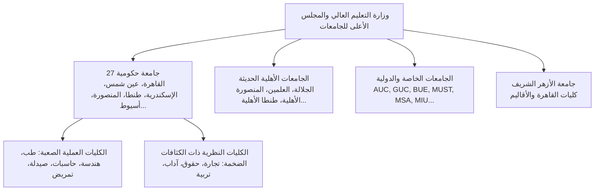

# الموسوعة الشاملة للطلبة والجامعات في مصر (Egyptian University Students Ecosystem)
### دليل اللوائح الأكاديمية، سيكولوجية الطالب، تفاصيل الحرم الجامعي، والمواصلات والأوراق الرسمية

يمثل الطلاب الجامعيون في مصر قوة بشرية هائلة تتجاوز 3.5 مليون طالب وطالبة موزعين بين الجامعات الحكومية العريقة، الجامعات الأهلية المنشأة حديثاً، والجامعات الخاصة والدولية. فهم البيئة الجامعية المصرية الحقيقية بتفاصيلها هو سر نجاح أي منصة أو خدمة أكاديمية.

---

## 1. خريطة منظومة التعليم العالي في مصر

### الجامعات الحكومية الكبرى وترتيب تركيزها:
1. **جامعة طنطا (عروس الدلتا):** مجمع كليات سبرباي (الهندسة، الحاسبات، الزراعة، طنطا الأهلية)، المجمع الطبي بشارع الجيش (الطب، الصيدلة، طب الأسنان، التمريض، العلوم)، ومجمع كليات الملاحة (التجارة، الآداب، الحقوق، التربية).
2. **جامعة القاهرة:** صرح الجيزة التاريخي (ساعة الجامعة، القبة، كلية الحقوق والتجارة والآداب، بين السرايات ومكتبات تصوير المذكرات)، وهندسة القاهرة بشارع الجامعة.
3. **جامعة عين شمس:** العباسية وروكسي، قصر الزعفران، كلية الهندسة بعبده باشا، كلية الحاسبات والمعلومات، وكلية الطب بالدمرداش.
4. **جامعة الإسكندرية:** مجمع الشاطبي، المجمع النظري بسوتر، وكلية الهندسة ومعهد الأبحاث.
5. **جامعة المنصورة:** عاصمة الطب وعاصمة الدلتا الأكاديمية، مجمع الكليات ومستشفيات جامعة المنصورة المتطورة.

---

## 2. الأنظمة الأكاديمية واللوائح الدراسية في مصر

### 1. نظام الساعات المعتمدة (Credit Hours System):
- أصبح النظام السائد في أغلب الكليات المصرية الحديثة واللوائح المحدثة (مثل لائحة هندسة طنطا 2023، حاسبات طنطا 2023، هندسة وحاسبات المنصورة 2023، طب الساعات المعتمدة 5+2).
- **المصطلحات الحاسمة:**
  - **GPA (المعدل التراكمي من 4.0):**
    - 3.4+ : امتياز (A / A-)
    - 2.8 - 3.39 : جيد جداً (B+ / B)
    - 2.2 - 2.79 : جيد (C+ / C)
    - 2.0 - 2.19 : مقبول (D+ / D)
    - أقل من 2.0 : إنذار أكاديمي (Academic Probation / Warning)
  - **فترة الحذف والإضافة (Add/Drop Period):** أول أسبوعين في التيرم لاختيار المقررات وتوزيع الساعات (بين 12 إلى 19 ساعة معتمدة حسب معدل الطالب).
  - **سقف الحرمان من دخول الامتحان (Denial / Deprivation):** غياب يتجاوز **25%** من مجموع المحاضرات والسكاشن يستوجب الحرمان التلقائي إلا بعذر طبي معتمد من الإدارة الطبية بالجامعة.

### 2. النظام الفصلي القديم (Two-Semester Traditional System):
- لا يزال مطبقاً في بعض الكليات النظرية؛ يعتمد على المجموع الكلي والنسبة المئوية، مع دور ثانٍ (امتحانات سبتمبر / الملاحق) للراسبين في مادتين أو أقل.

---

## 3. يوميات الطالب الجامعي واللوجستيات في مصر

### 1. المواصلات والتنقل اليومي:
- **اشتراكات مترو الأنفاق بالقاهرة الكبرى:** تخفيض حكومي يصل إلى 95% للطلبة بموجب استمارة اشتراك معتمدة بختم النسر من شؤون طلاب الكلية.
- **اشتراكات سكك حديد مصر (القطارات):** شريان الحياة لملايين طلاب الأقاليم الذين يسافرون يومياً بين المحافظات (مثل: خط طنطا - الإسكندرية، خط بنها - القاهرة، خط المنصورة - طنطا).
- **مجمعات المواقف والميكروباصات:** موقف سبرباي بطنطا، موقف عبود، موقف المرج، موقف المنيب، محطة مصر برمسيس.

### 2. السكن الجامعي والمغتربون:
- **المدن الجامعية الحكومية:** التقديم يتم عبر الموقع الرسمي الموحد (نظام الزهراء للمدن الجامعية)، وتتطلب معايير دقيقة (بعد المسافة الجغرافية عن الكلية، تقدير الطالب في العام السابق، عدم وجود عقوبات تأديبية).
- **السكن الخارجي الخاص (شقق المغتربين):** استئجار شقق مفروشة مشتركة (3 إلى 6 طلاب في الشقة)، مع تقاسم مصاريف الإيجار والكهرباء والإنترنت، ومواجهة تحديات الطبخ والغسيل والمصروف الشخصي.

### 3. ثقافة المذكرات والمكتبات والسناتر:
- "شارع المكتبات" المحيط بكل كلية (بين السرايات بجامعة القاهرة، شارع الحلو بطنطا، شارع كلية تجارة بالمنصورة) هو القلب النابض لطباعة المحاضرات، حلول الشيتات، والمذكرات المختصرة قبل ليلة الامتحان.

---

## 4. المعاملات الإدارية والأوراق الرسمية للطلاب

1. **شهادة إثبات القيد:** الوثيقة الرسمية الصادرة من شؤون الطلاب لإثبات قيد الطالب بالكلية، مطلوبة لاستخراج اشتراكات المواصلات، السفارات، واستخراج بطاقة الرقم القومي.
2. **نماذج التجنيد العسكري (للذكور):**
   - **نموذج 2 جند:** للتأجيل الدراسي من التجنيد أثناء سنوات الدراسة الجامعية.
   - **نموذج 6 جند أو 7 جند:** بطاقة الخدمة العسكرية التي تستخرج من قسم الشرطة التابع له الطالب.
   - **إذن السفر العسكري:** للطلاب الراغبين في السفر للخارج خلال الإجازات السنوية.
3. **كارنيه التأمين الصحي الجامعي:** يتيح الكشف المجاني وصرف الأدوية وإجراء العمليات الجراحية في المستشفيات الجامعية التابعة لكل كلية طب.

---

## 5. مراجع ملحقة
- دليل لوائح وإجراءات التجنيد والساعات المعتمدة: [references/academic_regulations_eg.md](./references/academic_regulations_eg.md)