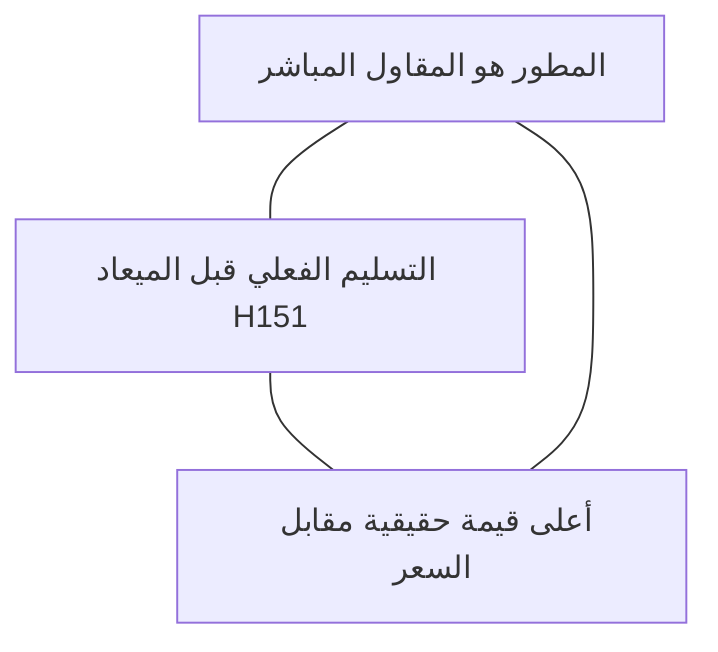

# 📈 استراتيجية التسويق والبراندينج العقاري (Real Estate Marketing & Branding)
### بناء السلطة المؤسسية، خوارزميات Meta Ads، واقتصاديات الوحدة والـ Sales Pipeline

---

## 1. نموذج البراندينج العقاري الفاخر (Brand Archetype & Positioning)
في سوق العقارات المصري المليء بوعود المطورين، لا يبحث العميل عن "شركة بتبيع كلام"، بل يبحث عن **"الصانع الماهر الأمين" (The Master Craftsman & Reliable Builder)**.

### مثلث التموضع التنافسي (The Engaz Advantage Triangle):

* **صوت العلامة التجارية:** واثق، هادئ، يتحدث بلغة الأرقام والهندسة وليس الشعارات الرنانة.
* **الأصول الاستراتيجية للثقة (Institutional Trust Assets):**
  - العقود مع الجهات السيادية (مثل تسويق أصول سفارة سلطنة عُمان).
  - تسليم مشاريع سابقة على أرض الواقع (H151 بالتجمع، برج المعلمين ببسيون، فيلات المنصورة).
  - الشرط الجزائي الصريح في العقود ضد أي يوم تأخير.

---

## 2. استراتيجية إعلانات Meta والبيرفورمانس ماركتينج 2026
* **هيكل الحملات في عصر الـ AI (Advantage+ & Lattice):**
  - تجنب تشتيت الميزانية على 20 إعلان بميزانيات ميكروسكوبية. المنهجية المعتمدة هي تجميع الميزانية في حملة عريضة (Broad Targeting) وترك خوارزميات الذكاء الاصطناعي تحدد المشترين بناءً على **الكرييتف والسكريبت (Creative-Led Targeting)**.
  - إعلان يتحدث عن شقق التجمع وقسط 27 ألف سيقوم الفيس بوك بتوجيهه تلقائياً للمهتمين بالتجمع الخامس بالقاهرة الجديدة.
* **اقتصاديات الوحدة العقارية (Real Estate Unit Economics):**
  - **تكلفة الليد (CPL):** تتراوح في التجمع بين 150 - 250 ج.م لليد المؤهل، وفي بسيون بين 15 - 35 ج.م.
  - **تكلفة المعاينة الميدانية (CPSV - Cost Per Show-Up):** هي المؤشر الأهم؛ العميل الذي يأتي لمعاينة H151 و A100 تزيد فرصة إغلاق صفقته بـ 8 أضعاف مقارنة بالعميل الهاتفي.

---

## 3. مراحل الـ Funnel من المشاهدة إلى توقيع العقد:
1. **Top of Funnel (TOF - Awareness):** فيديوهات سابقة الأعمال، إثبات تسليم H151، فخاخ الشراء في التجمع.
2. **Middle of Funnel (MOF - Consideration):** جولات الشقق الـ 134م والـ 218م على أرض الواقع، مقارنة المقاول المباشر بالوسيط، الحسبة المالية للأقساط.
3. **Bottom of Funnel (BOF - Decision):** دعوة المعاينة الميدانية المجانية بسيارات الشركة يوم الجمعة، إتاحة الحجز بمقدم التعاقد، مقابلة مايكل وفريق المبيعات على الموقع.