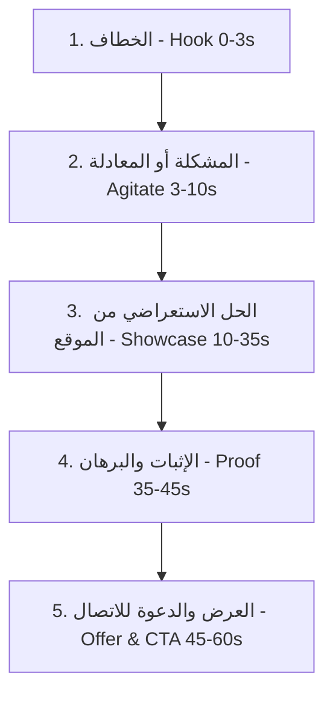

# ✍️ دليل كتابة السكريبتات والإعلانات العقارية (Real Estate Copywriting & Scripts)
### فن الإقناع المالي والهندسي، هندسة الهوكس (Hooks)، وصياغة النصوص البيعية القاتلة

---

## 1. الهيكل السحري لسكريبت الفيديو العقاري (The Real Estate VSL Formula)
كل سكريبت عقاري ناجح يتكون من 5 عناصر متتالية لا غنى عنها:

1. **الخطاف (The Hook - 0-3 ثوانٍ):**
   - كسر التوقع أو الصدمة برقم محدد أو حقيقة غير تقليدية: *"عمرنا ما قولنا أقل سعر.. بس بنقول أعلى قيمة مقابل سعر"*.
2. **المعادلة أو حيرة العميل (The Core Dilemma - 3-10 ثوانٍ):**
   - ملامسة الألم الحقيقي للعميل: حيرة الموازنة بين السعر الرخيص والخامات التي تدوم، أو الخوف من تأخير الاستلام.
3. **الحل المجسد على أرض الواقع (The On-Site Showcase - 10-35 ثانية):**
   - استعراض الميزات الهندسية الصريحة: الشقة الـ 134م بدون هدر مساحات، الميكانيكال رخام، المصاعد، الشوارع الواسعة.
4. **الدليل والبرهان القاطع (The Concrete Proof - 35-45 ثانية):**
   - الربط بمشروع مسلَّم بالفعل: *"وقبل ما تمضي أي ورقة، هتدخل معانا مبنى H151 المسلَّم في نفس المنطقة وتشوف بعينك"*.
5. **العرض الصريح والدعوة للتحرك (Clear Offer & Action - 45-60 ثانية):**
   - أرقام واضحة (المقدم والقسط) + توجيه فوري: *"سيبلنا كومنت وفريق إنجاز هيتواصل معاك .. Engaz Developments وده إنجازنا"*.

---

## 2. بنك صيغ الهوكس العقارية القاتلة (High-Converting Hook Formulas)
* **صيغة الحساب الصريح (The Math Hook):**
  - "ليه تدفع 7 مليون كاش في شقة جاهزة.. لما تقدر تدفع 820 ألف مقدم وتقسط على 5 سنين بدون فوائد؟"
* **صيغة التحدي والمصداقية (The Proof-First Hook):**
  - "في 2022 فيه ناس وثقت في مشروع على ورق.. في 2026 إحنا بنسلمهم المبنى قبل ميعاده بنسبة تطابق متقلش 1%!"
* **صيغة كشف الفخاخ (The Warning Hook):**
  - "أكبر فخ ممكن تقع فيه وأنت بتشتري شقة في التجمع: تبص على المساحة الإجمالية وتنسى المساحة الصافية!"
* **صيغة فض الحيرة (The Balance Hook):**
  - "حيرة السعر ولا الجودة ولا الشكل دايماً قرار صعب ومحير.. بس إحنا وازنا بين التلاتة دايماً!"

---

## 3. صياغة نصوص إعلانات Meta (Primary Text & Headlines)
* **النص الأساسي (Primary Text):**
  - لا تبدأ بمقدمات تقليدية مثل ("تعلن الشركة عن فتح باب الحجز..."). ابدأ بالقصة أو الحسبة المالية فوراً.
  - استخدم فقرات قصيرة جداً (سطر أو سطرين) مع فواصل واضحة ونقاط نقطية (Bullet Points).
  - اذكر الأرقام بوضوح: المساحة، سعر الكاش، المقدم، وقيمة القسط الشهري لفلترة العملاء غير الجادين ورفع جودة الـ Leads.
* **العنوان الرئيسي (Headline):**
  - قصير، قوي، يحفز على النقرة: *"شقة 134م بربوة التجمع | قسط 27 ألف | عاين H151 على الطبيعة"*.