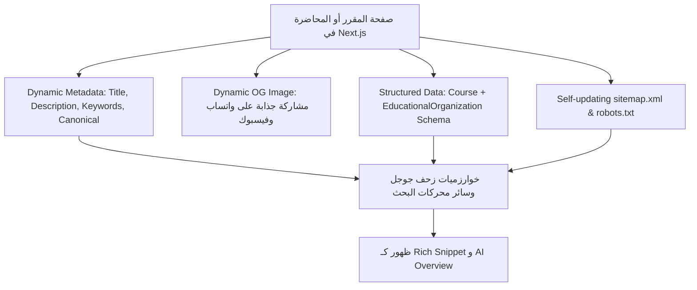

# محرك تحسين نتائج محركات البحث (SEO & GEO Playbook)
### تصدر نتائج جوجل، السيو البرمجي (Programmatic SEO)، وتضمين الذكاء الاصطناعي (GEO) للمواقع التعليمية والجامعية

الطلاب الجامعيون في مصر يبحثون يومياً بمئات الآلاف من الاستعلامات على جوجل للعثور على جداول الامتحانات، حلول الشيتات، والمذكرات. الاستحواذ على هذه الزيارات مجاناً هو أقوى وأرخص قناة نمو للمنصة.

---

## 1. المعمارية التقنية للسيو في Next.js (Technical SEO Architecture)



### 1. إعداد البيانات الوصفية الديناميكية (Dynamic Metadata in Next.js):
```typescript
// src/app/app/materials/[course]/page.tsx
import { Metadata } from 'next';

export async function generateMetadata({ params }: { params: { course: string } }): Promise<Metadata> {
  const courseCode = decodeURIComponent(params.course);
  return {
    title: `مقرر ${courseCode} | ملخصات، شيتات وامتحانات سابقة محلولة - منصة مُدَرّج`,
    description: `حمل مذكرات ومحاضرات وبنك أسئلة مادة ${courseCode} بنماذج الإجابات الرسمية المعتمدة لطلاب الكلية.`,
    alternates: {
      canonical: `https://elmodarag.com/app/materials/${params.course}`,
    },
    openGraph: {
      title: `مقرر ${courseCode} - بنك الأسئلة والحلول المعتمدة`,
      description: 'جميع المحاضرات والشيتات والامتحانات السابقة بنقرة واحدة على منصة مدرج.',
      url: `https://elmodarag.com/app/materials/${params.course}`,
      siteName: 'منصة مُدَرّج الجامعية',
      locale: 'ar_EG',
      type: 'website',
    },
  };
}
```

---

## 2. البيانات المنظمة (JSON-LD Structured Data / Schema.org)
جوجل ومحركات الذكاء الاصطناعي (Gemini, Perplexity, ChatGPT Search) تعتمد على Schema.org لفهم هيكل المواد والكورسات:

```tsx
// Course Structured Data Component
export function CourseSchema({ courseName, courseCode, description, universityName }: any) {
  const schemaData = {
    '@context': 'https://schema.org',
    '@type': 'Course',
    name: courseName,
    courseCode: courseCode,
    description: description,
    provider: {
      '@type': 'EducationalOrganization',
      name: universityName || 'جامعة طنطا',
      sameAs: 'https://elmodarag.com',
    },
    inLanguage: 'ar-EG',
  };

  return (
    <script
      type="application/ld+json"
      dangerouslySetInnerHTML={{ __html: JSON.stringify(schemaData) }}
    />
  );
}
```

---

## 3. استراتيجية السيو البرمجي (Programmatic SEO) للجامعات المصرية

بدلاً من كتابة صفحات يدوياً، يتم توليد آلاف الصفحات المهيأة للسيو برمجياً لكل تقاطع بين:
`[الجامعة] × [الكلية] × [القسم] × [الفرقة الدراسية] × [المقرر / شيتات / امتحانات فاينال]`

### أنماط البحث الأكثر تكراراً لدى الطلاب المصريين:
- `"جدول امتحانات [الكلية] [الجامعة] [السنة]"`
- `"ملخص مادة [اسم المقرر] [الفرقة] [الكلية]"`
- `"شيتات وحلول مادة [كود المادة] pdf"`
- `"امتحانات سابقة [اسم المادة] [الكلية]"`
- `"حساب المعدل التراكمي GPA [اسم الكلية] ساعات معتمدة"`

---

## 4. تحسين محركات الذكاء الاصطناعي (GEO - Generative Engine Optimization)
كيف تجعل منصتك المصدر الأول الذي تقتبس منه محركات الذكاء الاصطناعي عندما يسألها الطالب؟
1. **تقديم إجابات مباشرة ومحددة (Direct Answers):**
   - وضع ملخص من 30 إلى 50 كلمة في بداية كل صفحة مقرر أو موضوع يشرح الفكرة بوضوح.
2. **جداول المقارنة والأرقام والبيانات الصريحة:**
   - نماذج الساعات، درجات أعمال السنة، الميدتيرم، والفاينال في جداول منسقة بوضوح.
3. **موثوقية المحتوى (E-E-A-T):**
   - وضع اسم المحاضر المعيد/الدكتور المعتمد، تاريخ التحديث، وتوثيق بطاقة الطالب الناشر.

---

## 5. مراجع ملحقة
- ملف robots.txt و sitemap.xml المثالي لـ Next.js: [references/seo_configs.md](./references/seo_configs.md)