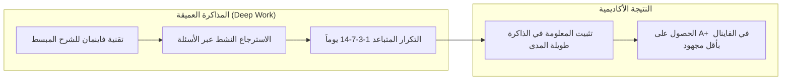

# دليل حياة وإنتاجية الطالب الجامعي في مصر (Student Life & Productivity Playbook)
### المذاكرة الذكية، إدارة الوقت والامتحانات، الميزانية الشهرية، والتفوق مع حفظ التوازن النفسي

الحياة الجامعية في مصر مليئة بالتحديات: زحمة المواصلات، تكدس المناهج، الامتحانات المفاجئة (Quizzes & Midterms)، وضغوط التقدير التراكمي (GPA). هذا الدليل يلخص أحدث وأثبت أساليب الإنتاجية الأكاديمية المصممة لواقع الطالب المصري.

---

## 1. بروتوكول المذاكرة الذكية والتفوق الأكاديمي (Smart Academic Protocols)

### 1. تقنية فاينمان للشرح (Feynman Technique):
- لا تعتبر نفسك فهمت المحاضرة أو المعادلة الفيزيائية/الطبية إلا إذا استطعت شرحها لزميلك بالعامية البسيطة وبدون مصطلحات معقدة خلال دقيقتين.

### 2. الاسترجاع النشط (Active Recall):
- التوقف فوراً عن "إعادة قراءة السلايدات والملازم بالساعات" (Passive Reading) لأنها تعطي وهماً كاذباً بالفهم.
- الطريقة الصحيحة: قراءة الشابتر مرة واحدة، ثم غلقه وحل أسئلة شيت وامتحانات سابقة عليه فوراً في محاكي الامتحانات، وتحليل أسباب الأخطاء.

### 3. خطة طوارئ الامتحانات (72-Hour Exam Sprint):
- عند ضيق الوقت قبل الفاينال بـ 3 أيام:
  1. **قاعدة باريتو (80/20):** التركيز على الفصول التي تتكرر سنوياً وتمثل 80% من درجات الامتحان.
  2. **تحليل امتحانات الدكاترة السابقة:** أغلب أساتذة الجامعات المصرية يعتمدون على أفكار امتحانات السنوات الثلاث الأخيرة مع تغيير الأرقام أو الصياغة.
  3. **استخدام بطاقات الأسئلة السريعة (Flashcards) ومحاكي الامتحانات.**

---

## 2. إدارة ميزانية ومصروف الطالب الجامعي المصري

كيف يدير الطالب ميزانيته الشهرية (بين 1,500 إلى 3,500 جنيه مصري في المتوسط):
- **المواصلات (30%):** استخراج اشتراك المترو أو القطار فوراً لتوفير حتى 90% من تكلفة المواصلات اليومية.
- **الأكل والشرب في الحرم (25%):** تحضير وجبات خفيفة أو ساندوتشات منزلية يوفر أكثر من 800 جنيه شهرياً مهدرة في كافيهات ومطاعم الجامعة.
- **مستلزمات الدراسة والطباعة (20%):** استخدام المنصات الرقمية وتجنب طباعة الكتب الضخمة التي لا تقرأ، والاكتفاء بطباعة الشيتات والملخصات المركزة فقط.
- **الطوارئ والادخار (25%):** حساب توفير شبابي بدون رسوم (مثل بطاقة تيلدا Telda، أو كارت ميزة، أو كارت بنك مصر للشباب).

---

## 3. التخفيضات والاشتراكات العالمية المتاحة مجاناً للطالب المصري:
- **GitHub Student Developer Pack:** أدوات برمجة وسيرفرات مجانية تتجاوز قيمتها 200,000 جنيه (GitHub Copilot, DigitalOcean, Canva Pro, JetBrains, Domain Name).
- **Notion for Education:** اشتراك مجاني مدى الحياة لتنظيم المحاضرات والمهام عبر الإيميل الجامعي (`.edu.eg`).
- **Spotify & Apple Music Student:** خصم 50% على الاشتراكات الموسيقية والبودكاست.
- **اشتراكات النقل والمتاحف المصرية:** دخول مجاني أو رمزي لجميع متاحف وقلاع وقصور وزارة الآثار المصرية بكارنيه الكلية.

---

## 4. مراجع ملحقة
- جدول المذاكرة اليومي وقالب البومودورو الجامعي: [references/study_schedule_template.md](./references/study_schedule_template.md)